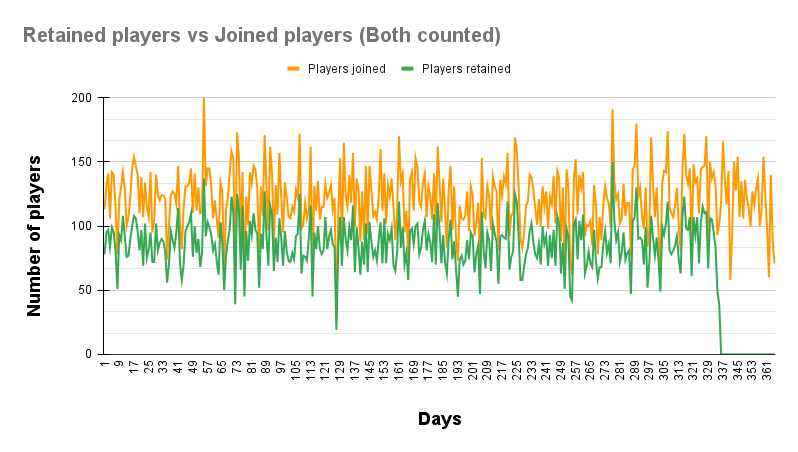
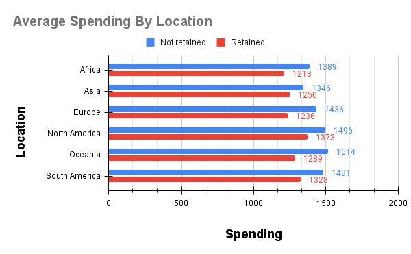
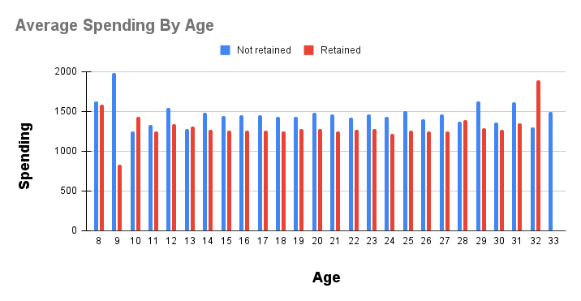

# **DATA ANALYSIS FOR A GAME COMPANY**

A mobile gaming company has hired us to quantify their 30 day retention for their one year anniversary, the questions are as follows:

1. Is the 30-day rolling retention increasing or decreasing over the lifecycle of the game?

2. Do retained players on average spend more or less on the game products than non-retained players by age and location?

The data set below is a relational database that includes four tables with varied content:

- Item information: item id, price 
- Match information: player id, match id, opponent id, outcome, days played
- Player information: player id, location, age, system, day joined
- Purchase information: player id, item id, day purchased

Google BigQuery was used to run the SQL queries and Google Sheets for visualizations.

## **Query for the 30-day rolling retention(increasing or decreasing)**

I used the player_info table to count the player_id and then grouped by the day they joined, this is to find the total number of players who joined each day. Also a subquery was incorporated into this query.

After doing using the `JOIN` function for the match_info table with the player_info table by the common key of player_id. We retrieved the maximum number of days the player played by using the `MAX` function along with a `CASE WHEN` syntax to obtain the number of players retained and not retained. The `CASE WHEN` syntax was essentially used to generate if the players were present for thirty days or more then they are considered retained and if it was lower than thirty days then they were not retained.

After joining these queries, I was able to populate the player count, retention status, fractional retention(calculated by `SUM(retention_status)/ COUNT(player_id)`, this is essentially calculating the retention rate of the total number of player joined.

### **Visualizations**

Two types of charts were created to render this:

As you can see from the above line charts where I have done a comparison between the joined players against the players retained. From this illustration, we can safely conclude that the company is doing a great job at retention which is fairly steady. To point out, day 277 had the highest number of retained players of 150 and the lowest on day 127 with 19 players for the lifecycle of the game. From day 336 onwards, there is a sudden drop in numbers of retained players simply because the query only incorporates the fact that this is a 30 day rolling retention and on this day, these players would not be able to play a match within the 30 day window before the year is completed plus there is simply no data for retained players. The retained players were lower than the players joined across the timeframe.

.png)

Also for the second graph above which is essentially the players retention (in percentage), we can see that the retention rate until day 336 has been well maintained between 60% and 85% retention rates. So this gaming company is doing fairly well with its retention and is considerably steady. Overall, the retention level is neither increasing nor decreasing over the lifecycle of the game.

## **Query for the spending of retained/non retained player by age and location**

On this query, a triple `JOIN` function had to be used in order to get the average and total spending, location and the age. We used the purchase_info, Item_info, player_info and match_info tables. First I started with joining the Item_info table in order to retrieve the total spending for the players, then joined it with another query by joining the player_info and match_info table to obtain the location and ages details for the players. Finally, I used this subquery and  nested it with an outer query and got the retention, age, location and the average spending of the players.Also on this query, I did not want to include any data past day '335' by using the `WHERE` clause because based on my retention analysis above, I only wanted to include the data involved spending by the players within 30 day rolling retention for the year and did not require any null data.

### **Visualizations**

As you may notice from the below two charts which illustrates the average spending by location and the average spending by age.

This above graph shows that the retained players spent lower than the non retained ones from all continents. So to me, I feel that the company should consider more in-game options to attract higher retention rates so that the retained players will start to spend more. Also a loyalty program would be a great option to sustain and potentially grow clientele.

The above graph outlines the average spending by the age group for retained vs non-retained players. For the most part, the spending for non retained players were higher than the retained players for most age groups except for the thirty-two and 10 year olds, this tells me that perhaps the retained players from this age groups enjoy the genre of the game the most. For age nine players, it appears that the non retained ones had the highest spending amongst all other age groups but also the least amount of retained players. Finally for the age 'thirty-three' players, there were no retained players and I guess my only conclusion to this would be that perhaps the company could increase the variety of games to their liking.

## **REFERENCES:**

**Google sheets for retentions data:**
https://docs.google.com/spreadsheets/d/1PthgCzzGT96ARQnHtguA-_YwQIwSI6F-trkUuaaoA2k/edit?usp=sharing

**Google sheets for spending data by age and location:**
https://docs.google.com/spreadsheets/d/1alD_AW41SoTzG_-Iq0pB8sylxOhlit5Ck_F79pGroHY/edit?usp=sharing

**SQL Queries:** 

Please refer to files name 'SQL Queries.txt'
